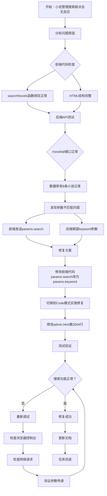

# 小说管理搜索框修复流程图



## 流程图说明

### 问题诊断阶段
1. **开始**：用户报告小说管理搜索框点击无反应
2. **分析问题**：系统化检查前端和后端
3. **前端检查**：确认JavaScript函数绑定和HTML结构正常
4. **后端测试**：验证API接口正常工作，数据库有数据

### 问题发现
5. **参数不匹配**：发现前端发送`params.search`，后端期望`keyword`参数

### 修复实施
6. **修复方案**：修改前端代码，将`params.search`改为`params.keyword`
7. **模式切换**：从Architect模式切换到Code模式进行代码修改
8. **代码修改**：具体修改`admin.html`第2004行

### 测试验证
9. **测试验证**：启动应用，测试搜索功能
10. **结果检查**：验证搜索功能是否恢复正常
11. **故障排除**：如果失败，检查浏览器控制台、网络请求和参数传递

### 完成阶段
12. **修复成功**：搜索功能正常工作
13. **文档更新**：更新相关文档记录修复过程
14. **任务完成**：问题解决

## 关键修改点

```javascript
// 修改前（第2004行）
if (searchKeyword && searchKeyword.trim() !== '') {
    params.search = searchKeyword.trim();
}

// 修改后
if (searchKeyword && searchKeyword.trim() !== '') {
    params.keyword = searchKeyword.trim();
}
```

## 测试步骤
1. 启动Spring Boot应用
2. 登录管理后台（管理员账号）
3. 导航到"内容管理" → "小说管理"
4. 在搜索框中输入测试关键词（如"测试"）
5. 点击"搜索"按钮
6. 验证搜索结果是否正确显示
7. 测试清空搜索功能

## 预期结果
- 搜索框响应点击事件
- 搜索请求正确发送到后端
- 搜索结果正确显示在表格中
- 状态筛选与搜索功能可以组合使用