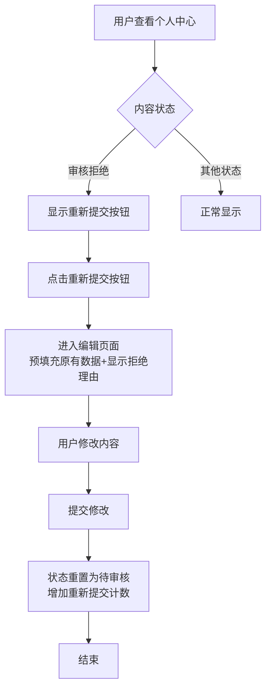

# 小说功能改进计划

## 项目概述
针对用户提出的三个问题，制定详细的改进计划：
1. 首页小说排行榜增加封面显示
2. 小说名称重名检查功能
3. 审核管理功能优化

## 一、首页排行榜增加封面显示

### 当前状态分析
- 小说实体已有 `coverImage` 字段
- 数据库中存在封面数据（如 `/uploads/xxx.png`）
- 排行榜API返回的数据包含封面字段
- 前端 `index.html` 未显示封面图片

### 实施步骤
1. **修改前端HTML/CSS** (`index.html`)
   - 在排行榜项中添加封面图片容器
   - 调整CSS布局，支持图片显示
   - 添加默认封面处理逻辑

2. **修改JavaScript渲染逻辑**
   - 更新 `loadRanking` 函数中的HTML模板
   - 添加封面图片显示代码
   - 处理封面URL为空的情况

3. **测试验证**
   - 验证封面显示效果
   - 测试响应式布局
   - 验证默认封面显示

### 技术细节
```html
<!-- 修改后的排行榜项模板 -->
<div class="ranking-item">
    <div class="rank-number top1">1</div>
    <div class="cover-container">
        
    </div>
    <div class="novel-info">
        <div class="novel-title"><a href="/novel/detail/${novel.id}">${novel.title}</a></div>
        <div class="novel-meta">
            <span>作者：${novel.author.nickname}</span>
            <span>阅读：${novel.viewCount}</span>
        </div>
    </div>
</div>
```

## 二、小说名称重名检查功能

### 需求分析
**选项1：完全禁止重名**
- 优点：避免混淆，保持唯一性
- 缺点：限制创作自由

**选项2：允许同一作者重名**
- 优点：平衡唯一性和创作自由
- 缺点：不同作者可能产生混淆

**选项3：仅警告不阻止**
- 优点：最大创作自由
- 缺点：可能造成用户体验问题

### 推荐方案：配置化重名检查
1. **系统配置**：添加重名检查策略配置
2. **前端验证**：实时检查标题是否重复
3. **后端验证**：创建/更新时检查
4. **错误提示**：友好的用户提示

### 实施步骤
1. **数据库层面**
   - 添加 `title` 字段的唯一索引（可选）
   - 或添加 `(title, author_id)` 复合唯一索引

2. **后端服务层**
   - 在 `NovelService.createNovel()` 和 `updateNovel()` 中添加检查
   - 添加 `checkDuplicateTitle()` 方法
   - 返回详细的错误信息

3. **前端验证**
   - 添加实时AJAX检查
   - 表单提交前验证
   - 显示友好的提示信息

4. **配置管理**
   - 添加系统配置表
   - 支持管理员动态调整策略

### 代码示例
```java
// 重名检查方法
public boolean isTitleDuplicate(String title, Long authorId, Long excludeNovelId) {
    // 根据配置策略检查
    // 策略1：完全禁止重名
    // 策略2：同一作者可重名
    // 策略3：不检查
}
```

## 三、审核管理功能优化（根据用户反馈细化）

### 用户需求明确
1. **拒绝理由功能**：审核不通过时需要提供具体理由
2. **重新提交机制**：用户可以在个人中心重新提交被拒绝的内容
3. **消息通知**：拒绝理由需要出现在用户的消息页面
4. **编辑页面预填充**：重新提交时进入保存了原有数据的编辑页面

### 详细设计方案

#### 1. 数据库修改
```sql
-- 在novel表中添加拒绝理由字段
ALTER TABLE novel ADD COLUMN reject_reason TEXT;

-- 在post表中添加拒绝理由字段（帖子也需要）
ALTER TABLE post ADD COLUMN reject_reason TEXT;

-- 可选：添加重新提交次数字段，用于统计
ALTER TABLE novel ADD COLUMN resubmit_count INT DEFAULT 0;
ALTER TABLE post ADD COLUMN resubmit_count INT DEFAULT 0;
```

#### 2. 重新提交流程


#### 3. 消息通知设计
- **消息表**：使用现有的 `message` 表
- **消息内容**："您的小说《xxx》审核未通过。理由：xxx"
- **显示位置**：用户的消息页面 (`/message`)
- **触发时机**：管理员拒绝时自动发送

#### 4. 页面修改需求

##### 个人中心页面
- 在"我的小说"列表中，为审核拒绝状态（`audit_status=2`）的小说显示"重新提交"按钮
- 按钮样式：使用醒目的颜色（如橙色）
- 按钮文字："重新提交（被拒绝）"

##### 编辑页面 (`novel-create.html` 和 `post-create.html`)
- 支持从拒绝状态预填充所有原有数据
- 在页面顶部显示拒绝理由（只读，灰色背景）
- 提交按钮文字改为"重新提交审核"
- 提交后状态自动从2（拒绝）改为0（待审核）

##### 管理后台审核页面 (`admin.html`)
- 拒绝时弹出模态框要求输入理由
- 理由为必填项，最少10个字符
- 保存理由到数据库并发送消息通知

#### 5. API接口修改

##### 现有接口扩展：
```java
// 拒绝时添加理由参数
@PostMapping("/reject/{id}")
public Response<Void> rejectNovel(@PathVariable Long id,
                                  @RequestParam String reason) {
    // 1. 更新novel状态为2
    // 2. 保存拒绝理由到reject_reason字段
    // 3. 发送消息通知给作者
    // 4. 返回成功
}

// 帖子拒绝接口也需要类似修改
@PostMapping("/post/reject/{id}")
public Response<Void> rejectPost(@PathVariable Long id,
                                 @RequestParam String reason)
```

##### 新接口：
```java
// 重新提交接口
@PostMapping("/resubmit/{id}")
public Response<Novel> resubmitNovel(@PathVariable Long id) {
    // 1. 检查当前状态是否为2（拒绝）
    // 2. 将状态改为0（待审核）
    // 3. 增加resubmit_count计数
    // 4. 返回更新后的小说数据
}

// 获取拒绝理由
@GetMapping("/reject-reason/{id}")
public Response<String> getRejectReason(@PathVariable Long id) {
    // 返回拒绝理由，用于前端显示
}
```

#### 6. 实施步骤

**第一阶段：基础功能**
1. 数据库添加 `reject_reason` 字段
2. 修改拒绝API支持理由参数
3. 修改管理后台审核页面添加理由输入
4. 实现消息通知功能

**第二阶段：重新提交功能**
1. 个人中心页面添加重新提交按钮
2. 实现重新提交API
3. 修改编辑页面支持预填充和拒绝理由显示
4. 添加重新提交计数功能

**第三阶段：优化和扩展**
1. 批量拒绝功能（支持相同理由）
2. 审核历史记录
3. 拒绝理由模板功能
4. 数据统计和报表

### 技术要点
1. **数据一致性**：拒绝理由需要同时保存到数据库和发送消息
2. **状态管理**：确保状态转换正确（0→待审核，1→通过，2→拒绝）
3. **用户体验**：重新提交流程要简单直观
4. **错误处理**：处理各种边界情况（如重复提交、无效状态等）

## 四、实施优先级（根据用户反馈调整）

### 第一阶段：立即实施（本周）
1. **首页排行榜封面显示**
   - 修改 `index.html` 前端显示
   - 添加CSS样式支持
   - 测试响应式布局

2. **审核拒绝理由功能（基础）**
   - 数据库添加 `reject_reason` 字段
   - 修改拒绝API支持理由参数
   - 管理后台添加理由输入框
   - 发送消息通知到用户

### 第二阶段：核心功能（下周）
1. **重新提交机制**
   - 个人中心添加重新提交按钮
   - 实现重新提交API
   - 编辑页面预填充和拒绝理由显示
   - 添加重新提交计数

2. **消息通知优化**
   - 完善消息页面显示
   - 添加消息分类（审核通知）
   - 支持消息已读/未读状态

### 第三阶段：增强功能（下月）
1. **重名检查功能**
   - 数据库索引优化
   - 前端实时验证
   - 配置化管理界面

2. **批量审核功能**
   - 管理后台多选支持
   - 批量通过/拒绝
   - 批量消息通知

3. **审核历史记录**
   - 创建 `audit_history` 表
   - 记录完整审核轨迹
   - 提供查询接口

### 第四阶段：优化扩展（未来）
1. **配置化管理界面**
2. **高级重名检查策略**
3. **审核工作流自定义**
4. **数据统计和报表**

## 五、风险评估

### 技术风险
1. **封面显示**：低风险，纯前端修改
2. **重名检查**：中风险，涉及数据库索引和业务逻辑
3. **审核优化**：中风险，涉及数据库表变更和复杂业务逻辑

### 兼容性风险
- 现有数据迁移
- API向后兼容
- 前端向后兼容

### 性能影响
- 重名检查增加数据库查询
- 审核历史增加数据量
- 封面图片加载增加带宽

## 六、测试计划

### 单元测试
1. 重名检查逻辑测试
2. 审核状态转换测试
3. 封面URL处理测试

### 集成测试
1. 完整审核流程测试
2. 重名检查端到端测试
3. 封面显示响应式测试

### 用户验收测试
1. 管理员审核功能测试
2. 作者重新提交测试
3. 首页用户体验测试

## 七、部署计划

### 第一阶段（本周）
1. 首页排行榜封面显示
2. 基础重名检查功能
3. 审核拒绝理由功能

### 第二阶段（下周）
1. 重新提交机制
2. 审核历史记录
3. 批量审核功能

### 第三阶段（下月）
1. 配置化管理界面
2. 性能优化
3. 用户体验改进

## 八、成功指标

### 业务指标
1. 首页用户停留时间增加
2. 小说重复提交减少
3. 审核效率提升

### 技术指标
1. 页面加载时间不变或减少
2. 数据库查询性能稳定
3. 系统稳定性保持

---

**最后更新**：2026-01-18  
**负责人**：Kilo Code  
**状态**：待评审