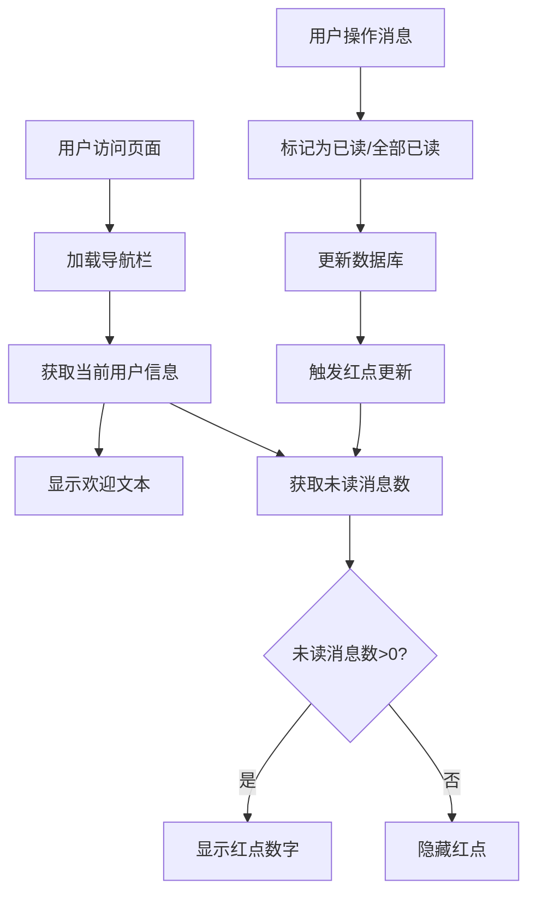

# 红点消息提示功能实现方案

## 1. 可行性分析

### 1.1 当前系统状态
基于对现有代码的分析，红点消息提示功能**完全可行**，原因如下：

1. **消息系统已完善**：
   - `Message`实体已有`isRead`字段（0未读，1已读）
   - `MessageRepository`有`countByUserIdAndIsRead`方法统计未读消息
   - `MessageService`有`getUnreadMessageCount`方法
   - `MessageController`有`/unread-count/{userId}`接口

2. **前端架构支持**：
   - 所有页面使用统一的导航栏模板
   - 导航栏中的"欢迎，xx"区域有固定ID：`#welcomeText`
   - 使用LayUI框架，支持动态DOM操作
   - 已实现AJAX获取当前用户信息

3. **数据库状态**：
   - 消息表有92条记录，其中15条未读
   - 用户ID=2有10条未读消息，用户ID=9有3条未读消息等
   - 数据结构完整，支持实时查询

### 1.2 技术实现路径
- **后端**：已有未读消息统计接口，无需新增
- **前端**：在获取用户信息时同时获取未读消息数
- **UI**：在导航栏"欢迎，xx"旁添加红点数字提示
- **实时性**：可通过定时轮询或WebSocket实现实时更新

## 2. 功能设计

### 2.1 显示位置
1. **首页** (`index.html`) - 导航栏"欢迎，xx"旁
2. **小说列表页** (`novel-list.html`) - 导航栏"欢迎，xx"旁  
3. **帖子列表页** (`post-list.html`) - 导航栏"欢迎，xx"旁
4. **个人中心页** (`profile.html`) - 导航栏"欢迎，xx"旁

### 2.2 红点样式
- **有未读消息**：显示红色圆形背景，白色数字
- **无未读消息**：不显示红点
- **数字显示**：显示具体未读数量（如"3"）
- **超过99条**：显示"99+"

### 2.3 交互逻辑
1. 用户登录后，立即显示未读消息数
2. 点击"个人中心" → "我的消息"查看消息
3. 阅读消息后，红点数字实时减少
4. 标记所有消息为已读后，红点消失

## 3. 技术实现方案

### 3.1 后端修改（最小化）
**无需新增接口**，利用现有接口：
- `/user/current` - 获取当前用户信息
- `/message/unread-count/{userId}` - 获取未读消息数

**优化建议**：可在`/user/current`响应中直接包含未读消息数，减少HTTP请求

### 3.2 前端修改

#### 3.2.1 修改所有模板的导航栏
在每个页面的导航栏"欢迎，xx"元素旁添加红点容器：
```html
<a href="javascript:;" id="welcomeText">欢迎，加载中...</a>
<span class="message-badge" id="messageBadge" style="display: none;"></span>
```

#### 3.2.2 修改用户信息获取逻辑
在现有的`/user/current` AJAX请求成功后，增加对未读消息数的获取：
```javascript
// 获取当前用户信息
$.ajax({
    url: '/user/current',
    type: 'GET',
    success: function(userRes) {
        if (userRes.code === 200 && userRes.data) {
            var user = userRes.data;
            $('#welcomeText').text('欢迎，' + user.nickname);
            
            // 获取未读消息数
            $.ajax({
                url: '/message/unread-count/' + user.id,
                type: 'GET',
                success: function(msgRes) {
                    if (msgRes.code === 200) {
                        updateMessageBadge(msgRes.data);
                    }
                }
            });
        }
    }
});
```

#### 3.2.3 红点更新函数
```javascript
function updateMessageBadge(count) {
    var $badge = $('#messageBadge');
    if (count > 0) {
        $badge.text(count > 99 ? '99+' : count);
        $badge.show();
    } else {
        $badge.hide();
    }
}
```

### 3.3 CSS样式
在`common.css`中添加：
```css
.message-badge {
    position: absolute;
    top: -5px;
    right: -10px;
    background-color: #ff4d4f;
    color: white;
    border-radius: 50%;
    min-width: 18px;
    height: 18px;
    font-size: 12px;
    line-height: 18px;
    text-align: center;
    padding: 0 4px;
    box-shadow: 0 0 0 1px white;
}
```

### 3.4 实时更新机制
**方案一：定时轮询**（简单可靠）
```javascript
// 每30秒检查一次未读消息
setInterval(function() {
    if (currentUser) {
        $.ajax({
            url: '/message/unread-count/' + currentUser.id,
            type: 'GET',
            success: function(res) {
                if (res.code === 200) {
                    updateMessageBadge(res.data);
                }
            }
        });
    }
}, 30000);
```

**方案二：消息阅读时实时更新**
在`markMessageAsRead`和`markAllMessagesAsRead`成功后调用`updateMessageBadge`

## 4. 实施步骤

### 步骤1：修改CSS文件
在`common.css`末尾添加红点样式

### 步骤2：修改导航栏模板
由于所有页面使用相同导航栏结构，需要修改：
1. `index.html`
2. `novel-list.html` 
3. `post-list.html`
4. `profile.html`
5. 其他可能包含导航栏的页面

### 步骤3：修改JavaScript逻辑
在每个页面的用户信息获取代码后添加未读消息获取逻辑

### 步骤4：添加实时更新
在个人中心的消息操作函数中添加红点更新

### 步骤5：测试验证
1. 登录有未读消息的用户
2. 验证红点显示正确
3. 阅读消息验证红点更新
4. 标记所有已读验证红点消失

## 5. 架构图



## 6. 风险评估与应对

### 6.1 风险点
1. **性能影响**：频繁查询未读消息数可能增加数据库压力
   - **应对**：使用缓存，限制查询频率（30秒一次）

2. **多标签页同步**：用户打开多个标签页时，红点状态可能不同步
   - **应对**：使用localStorage或BroadcastChannel同步状态

3. **移动端适配**：红点在小屏幕上可能显示异常
   - **应对**：使用响应式设计，调整红点位置和大小

### 6.2 兼容性考虑
- 支持所有现代浏览器
- 兼容LayUI现有样式
- 不影响现有功能

## 7. 扩展可能性

### 7.1 短期扩展
1. **声音提示**：收到新消息时播放提示音
2. **桌面通知**：浏览器通知API
3. **消息分类**：不同消息类型不同颜色

### 7.2 长期扩展
1. **WebSocket实时推送**：真正实时消息通知
2. **消息优先级**：重要消息特殊提示
3. **消息过期**：自动清理旧消息

## 8. 结论

**红点消息提示功能完全可行**，基于现有系统架构，只需：
1. 添加少量CSS样式
2. 修改前端JavaScript逻辑
3. 利用现有后端接口

**预计工作量**：2-3小时开发，1小时测试
**技术难度**：低
**风险等级**：低

建议立即开始实施，这将显著提升用户体验和系统交互性。