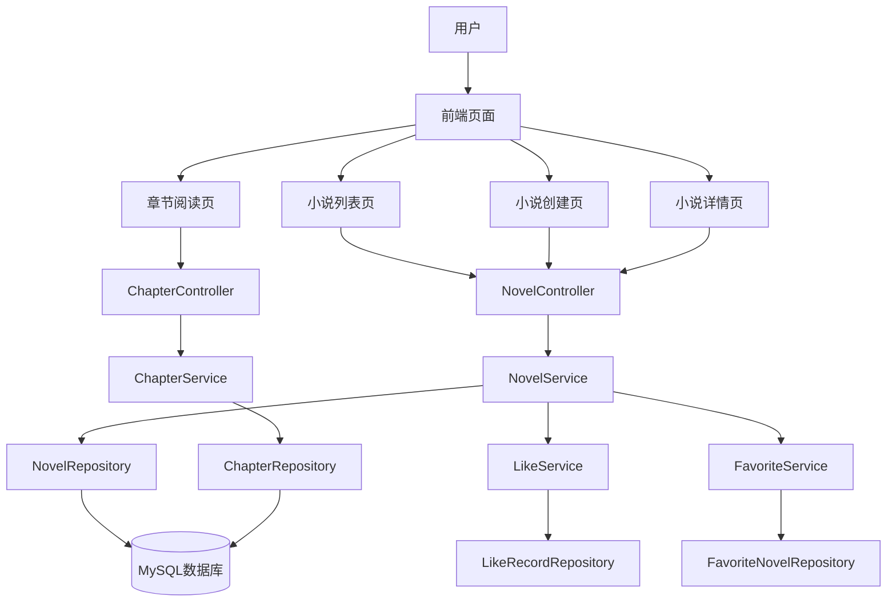

# 小说发布功能实现计划

## 项目概述
在现有论坛系统基础上，增加独立的小说模块，支持小说发布、章节管理、阅读、点赞收藏等功能。

## 需求总结
1. 独立的小说模块，包含小说实体和章节实体。
2. 小说字段：标题、封面、简介、分类、连载状态、作者笔名等。
3. 章节管理：每章独立发布、编辑、排序。
4. 阅读功能：小说详情页展示简介和章节目录，点击章节进入阅读页。
5. 互动功能：点赞、收藏（复用现有机制）。
6. 展示功能：排行榜、分类筛选、搜索（已实现）。

## 数据库设计

### 新增表

#### novel 表
| 字段名 | 类型 | 说明 |
|--------|------|------|
| id | bigint PRIMARY KEY AUTO_INCREMENT | 主键 |
| title | varchar(200) NOT NULL | 小说标题 |
| cover_image | varchar(500) | 封面图片URL |
| description | text | 简介 |
| author_id | bigint NOT NULL | 作者ID（关联user.id） |
| pen_name | varchar(100) | 作者笔名（默认为用户昵称） |
| status | tinyint DEFAULT 0 | 连载状态：0=连载中，1=已完结，2=暂停 |
| view_count | int DEFAULT 0 | 浏览量 |
| like_count | int DEFAULT 0 | 点赞数 |
| favorite_count | int DEFAULT 0 | 收藏数 |
| chapter_count | int DEFAULT 0 | 章节数 |
| is_deleted | tinyint DEFAULT 0 | 软删除标记 |
| create_time | datetime | 创建时间 |
| update_time | datetime | 更新时间 |

**注意**：原`tags`字段已移除，分类通过关联表`novel_category`实现多对多关系。

#### chapter 表
| 字段名 | 类型 | 说明 |
|--------|------|------|
| id | bigint PRIMARY KEY AUTO_INCREMENT | 主键 |
| novel_id | bigint NOT NULL | 所属小说ID |
| title | varchar(200) NOT NULL | 章节标题 |
| content | text | 章节内容 |
| sort_order | int DEFAULT 0 | 排序序号 |
| word_count | int DEFAULT 0 | 字数 |
| is_free | tinyint DEFAULT 1 | 是否免费（1免费，0收费） |
| view_count | int DEFAULT 0 | 章节浏览量 |
| create_time | datetime | 创建时间 |
| update_time | datetime | 更新时间 |

#### novel_category 表（新增）
| 字段名 | 类型 | 说明 |
|--------|------|------|
| novel_id | bigint NOT NULL | 小说ID |
| category_id | bigint NOT NULL | 分类ID |
| PRIMARY KEY (novel_id, category_id) | 联合主键 |

#### category 表（已存在）
| 字段名 | 类型 | 说明 |
|--------|------|------|
| id | bigint PRIMARY KEY AUTO_INCREMENT | 主键 |
| name | varchar(50) NOT NULL | 分类名称 |
| description | varchar(200) | 描述 |
| parent_id | bigint DEFAULT 0 | 父分类ID |
| sort_order | int DEFAULT 0 | 排序 |
| is_active | tinyint DEFAULT 1 | 是否启用 |
| create_time | datetime | 创建时间 |
| is_deleted | tinyint DEFAULT 0 | 软删除标记 |

### 现有表扩展
- `like_record` 表已有 target_type 字段，可扩展为：1=帖子，2=小说，3=章节。
- `favorite_post` 表目前只关联帖子，需要新建 `favorite_novel` 表或扩展为多类型。建议新建 `favorite_novel` 表以保持简单。

## 后端实现

### 阶段一：数据库与实体
1. 创建 Novel 实体类（已实现，包含多对多分类关联）
2. 创建 Chapter 实体类
3. 创建对应的 Repository 接口
4. 数据库迁移（已执行）

### 阶段二：服务层
1. NovelService 接口及实现：CRUD、列表、筛选、排序（已支持按分类搜索）
2. ChapterService 接口及实现：CRUD、按小说获取章节列表
3. 集成点赞收藏服务（扩展 LikeService 和 FavoriteService 支持小说）

### 阶段三：控制器层
1. NovelController：提供 REST API
   - GET /novel/list 小说列表（分页、筛选）
   - GET /novel/{id} 小说详情
   - POST /novel/create 创建小说（支持多分类ID数组 categoryIds）
   - PUT /novel/update 更新小说（支持多分类ID数组 categoryIds）
   - DELETE /novel/delete/{id} 删除小说
   - GET /novel/{id}/chapters 获取小说章节列表
2. ChapterController：
   - GET /chapter/{id} 获取章节内容
   - POST /chapter/create 创建章节
   - PUT /chapter/update 更新章节
   - DELETE /chapter/delete/{id} 删除章节
3. 集成点赞收藏端点（复用现有端点，扩展 target_type）

### 阶段四：业务逻辑
1. 小说封面上传（复用现有文件上传功能）
2. 作者笔名默认值处理
3. 章节排序自动计算
4. 字数统计
5. 浏览量统计

## 前端实现

### 阶段一：页面结构
1. 小说列表页 (`/novel/list`) – 展示所有小说，支持筛选排序
2. 小说创建页 (`/novel/create`) – 表单填写小说信息，多选分类
3. 小说详情页 (`/novel/{id}`) – 展示小说信息、章节目录、操作按钮
4. 章节管理页 (`/novel/{id}/chapters`) – 章节列表、添加、编辑、删除
5. 章节阅读页 (`/chapter/{id}`) – 阅读章节内容

### 阶段二：组件与交互
1. 复用现有 LayUI 组件
2. 集成富文本编辑器（用于章节内容）
3. 文件上传组件（封面）
4. 点赞收藏按钮组件
5. 多选分类下拉框（已实现）

### 阶段三：导航集成
1. 在主导航栏添加“小说”菜单项
2. 用户中心添加“我的小说”子菜单

## 任务分解（详细）

### 第一周：数据库与后端基础
1. 设计并创建数据库表（SQL脚本）
2. 创建 Novel 和 Chapter 实体类
3. 创建 Repository 接口
4. 实现 NovelService 和 ChapterService 基础 CRUD
5. 编写单元测试

### 第二周：后端功能完善
1. 实现小说列表分页、筛选、排序
2. 实现章节列表按排序输出
3. 集成点赞收藏功能（扩展 LikeRecord 和 FavoritePost）
4. 实现小说封面上传接口
5. 编写控制器层，提供 REST API

### 第三周：前端页面开发
1. 小说列表页（列表展示、分页、筛选）
2. 小说创建页（表单验证、封面上传、多选分类）
3. 小说详情页（展示信息、章节目录、点赞收藏）
4. 章节管理页（章节列表、添加编辑删除）
5. 章节阅读页（内容展示、上一章下一章导航）

### 第四周：集成与测试
1. 前后端联调
2. 功能测试（发布小说、添加章节、阅读、点赞收藏）
3. 性能优化（分页、缓存）
4. 安全验证（权限控制：作者只能管理自己的小说）
5. 部署上线

## 分类系统变更说明

原设计中使用`tags`字段（逗号分隔字符串）存储标签，与分类（category）存在重叠。经过分析，决定**移除标签，保留分类**，并将分类从单一关联改为**多对多关系**，以支持一个小说属于多个分类。

### 变更内容
1. **数据库**：
   - 移除`novel`表的`tags`字段。
   - 移除`novel`表的`category_id`字段。
   - 新增`novel_category`关联表。
2. **实体**：
   - `Novel`实体增加`@ManyToMany`映射到`Category`，使用`@JoinTable`。
   - 增加临时字段`categoryIds`（`@Transient`）用于接收前端数据。
   - `Category`实体增加反向映射`novels`。
3. **服务层**：
   - `NovelService`中创建和更新方法需要同步分类关系。
   - 搜索功能支持按分类名称搜索（关键词匹配分类名）。
4. **前端**：
   - 小说创建/编辑表单中，分类选择改为多选下拉框（`<select multiple>`）。
   - 小说列表页显示多个分类名称。

### 数据迁移
已执行SQL迁移脚本，将现有小说的`category_id`和`tags`转换为`novel_category`关联记录。

### 测试结果
- 创建小说（多分类）✅
- 更新小说（修改分类）✅
- 搜索分类（关键词匹配分类名）✅
- 列表显示多分类✅

## 架构图

## 风险与应对
1. **时间紧张**：优先实现核心功能（发布、章节、阅读），次要功能（排行榜、搜索）后续迭代。
2. **技术兼容**：确保现有帖子功能不受影响，点赞收藏表扩展需谨慎。
3. **用户体验**：前端页面保持与现有风格一致，减少学习成本。

## 下一步
1. 评审此计划，确认可行性。
2. 切换到 Code 模式开始实施。
开始